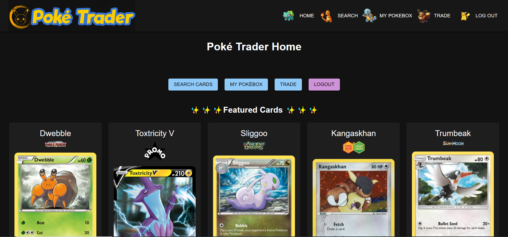
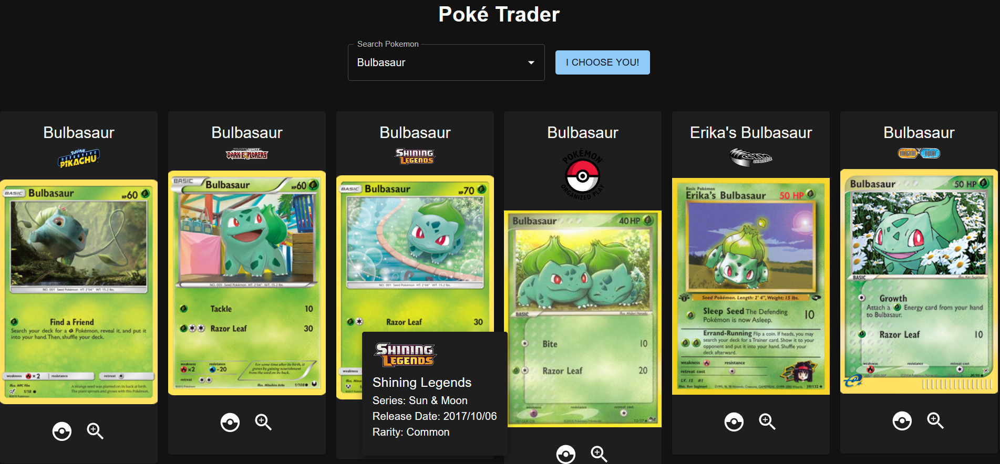
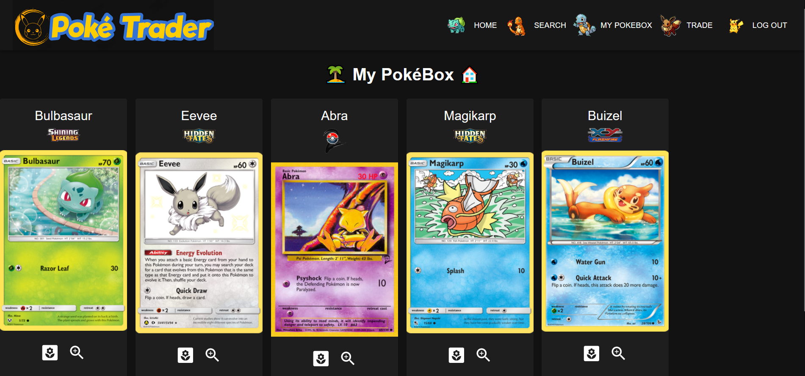
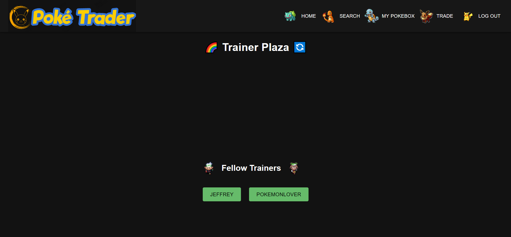
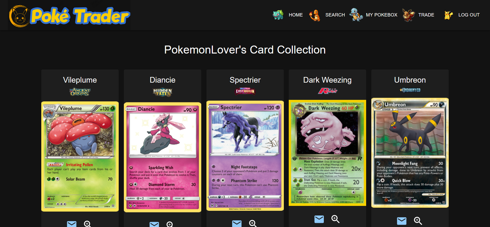

# Poké Trader

Reconnect with your childhood memories through this Pokémon trading card social media! Collect cards online and build your desired deck by trading your cards with your friends!

## Description

The purpose of this app is to facilitate trading between Pokémon card owners. After creating an account/logging in, players will given the option to browse cards, view their collection, or trade with another user.

Link to application: 

## Technologies Used

- Front-end: React
- Back-end: GraphQL with Node.js and Express.js server
- Server: MongoDB/Mongoose ODM
- Styling: Material UI

## Usage

- Log-In Screen: User can choose to create an account or log in with an existing account. If the user decides to create an account, they will be prompted for a username, email, and password (5 char min). If the user decides to log in, they will be prompted for the email and password of an existing account.

- After successfully logging in, users will be taken to the home page, where they can navigate to the following pages: Search Cards, My PokéBox, Trade, Logout. The home page will also display 5 featured cards.

- Search Cards: Enter the name of a Pokémon into the search bar and click the button labeled "I Choose You!" to search for cards featuring that Pokémon. For each card, click the magnifying glass icon to view additional information about the card, including the card's set name, series, release date, and rarity. Click on the Pokéball icon to add the card to your collection.

- My PokéBox: View all of the cards in your collection. Click on the magnifying glass icon to view additional information about the card. Click on the flower icon to remove the card from your collection.

- Trade: Click on the name of another trainer listed under "Fellow Trainers" to view their deck. When viewing another trainer's deck, click on the magnifying glass icon on any card to view additional information about the card. If you are interested in one of the trainer's cards, click on the mail icon corresponding with that card and modify the email message as needed to request a trade.

- Click on the "Log Out" button in the navigation bar to sign out of your account.

## Collaborators

George Lin: https://github.com/lingeorge88

Wendy Vu: https://github.com/chewytaro

Madilyn Bariekman: https://github.com/mcbariekman

Jeffrey Yeh: https://github.com/ETFruitNinja

## License

N/A
